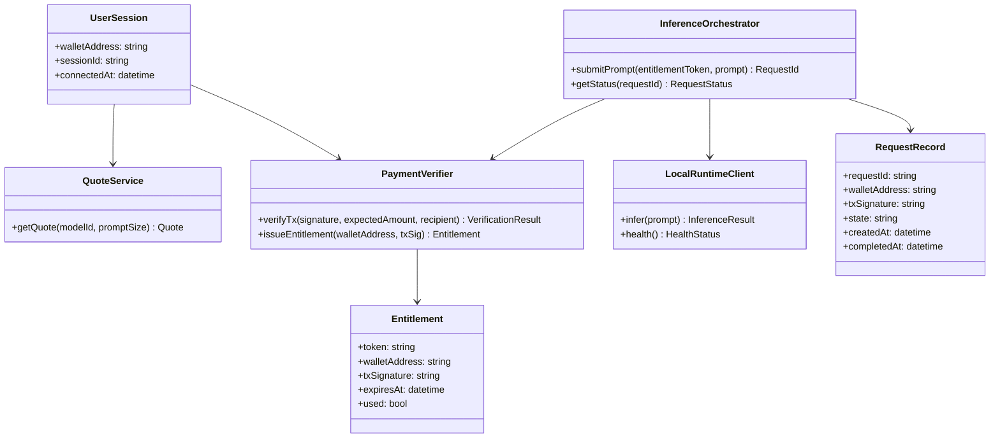

# Initial Class Diagram (Mermaid)

```mermaid
classDiagram
  class UserSession {
    +walletAddress: string
    +sessionId: string
    +connectedAt: datetime
  }

  class QuoteService {
    +getQuote(modelId, promptSize) Quote
  }

  class PaymentVerifier {
    +verifyTx(signature, expectedAmount, recipient) VerificationResult
    +issueEntitlement(walletAddress, txSig) Entitlement
  }

  class Entitlement {
    +token: string
    +walletAddress: string
    +txSignature: string
    +expiresAt: datetime
    +used: bool
  }

  class InferenceOrchestrator {
    +submitPrompt(entitlementToken, prompt) RequestId
    +getStatus(requestId) RequestStatus
  }

  class LocalRuntimeClient {
    +infer(prompt) InferenceResult
    +health() HealthStatus
  }

  class RequestRecord {
    +requestId: string
    +walletAddress: string
    +txSignature: string
    +state: string
    +createdAt: datetime
    +completedAt: datetime
  }

  UserSession --> QuoteService
  UserSession --> PaymentVerifier
  PaymentVerifier --> Entitlement
  InferenceOrchestrator --> PaymentVerifier
  InferenceOrchestrator --> LocalRuntimeClient
  InferenceOrchestrator --> RequestRecord
```
