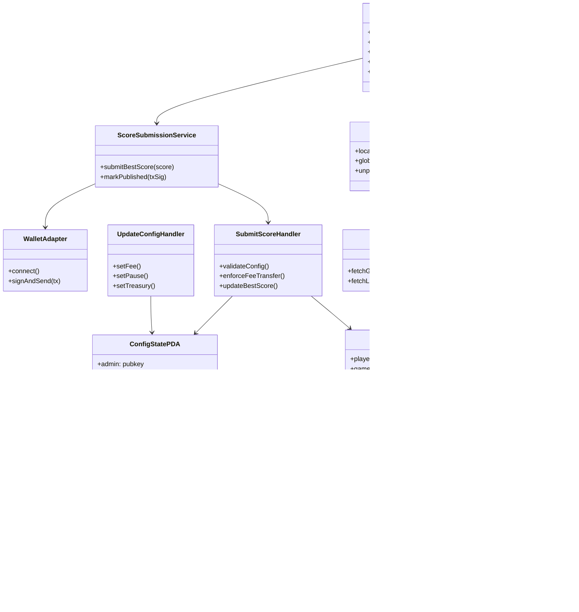

# Class / Domain Model Diagram (Mermaid)

```mermaid
classDiagram
  class GameSession {
    +sessionId: string
    +gameId: string
    +localScore: int
    +startedAt: datetime
    +endedAt: datetime
  }

  class WalletAdapter {
    +connect()
    +signAndSend(tx)
  }

  class ScoreSubmissionService {
    +submitBestScore(score)
    +markPublished(txSig)
  }

  class LeaderboardService {
    +fetchGlobalTop(gameId, limit)
    +fetchLocalTop(limit)
  }

  class LeaderboardViewModel {
    +localEntries
    +globalEntries
    +unpublishedBestScore
  }

  class ConfigStatePDA {
    +admin: pubkey
    +treasury: pubkey
    +submissionFeeLamports: u64
    +isPaused: bool
  }

  class PlayerScorePDA {
    +player: pubkey
    +gameId: string
    +bestScore: int
    +bestScoreSubmittedAt: i64
    +submitCount: u32
  }

  class SubmitScoreHandler {
    +validateConfig()
    +enforceFeeTransfer()
    +updateBestScore()
  }

  class UpdateConfigHandler {
    +setFee()
    +setPause()
    +setTreasury()
  }

  %% Roadmap-only conceptual classes
  class VerifiedSession {
    <<roadmap>>
    +sessionId
    +integrityMeta
  }
  class ActionRecord {
    <<roadmap>>
    +counter
    +prevHash
    +actionHash
  }
  class SessionTranscript {
    <<roadmap>>
    +rootHash
    +records[]
  }
  class ReplayVerifier {
    <<roadmap>>
    +verifyTranscript()
  }
  class ProofAdapter {
    <<roadmap>>
    +verifyProof()
  }

  GameSession --> ScoreSubmissionService
  GameSession --> LeaderboardViewModel
  ScoreSubmissionService --> WalletAdapter
  ScoreSubmissionService --> SubmitScoreHandler
  LeaderboardService --> PlayerScorePDA
  LeaderboardViewModel --> LeaderboardService
  SubmitScoreHandler --> ConfigStatePDA
  SubmitScoreHandler --> PlayerScorePDA
  UpdateConfigHandler --> ConfigStatePDA

  GameSession ..> VerifiedSession : roadmap
  VerifiedSession ..> ActionRecord : roadmap
  ActionRecord ..> SessionTranscript : roadmap
  SessionTranscript ..> ReplayVerifier : roadmap
  ReplayVerifier ..> ProofAdapter : roadmap
```
