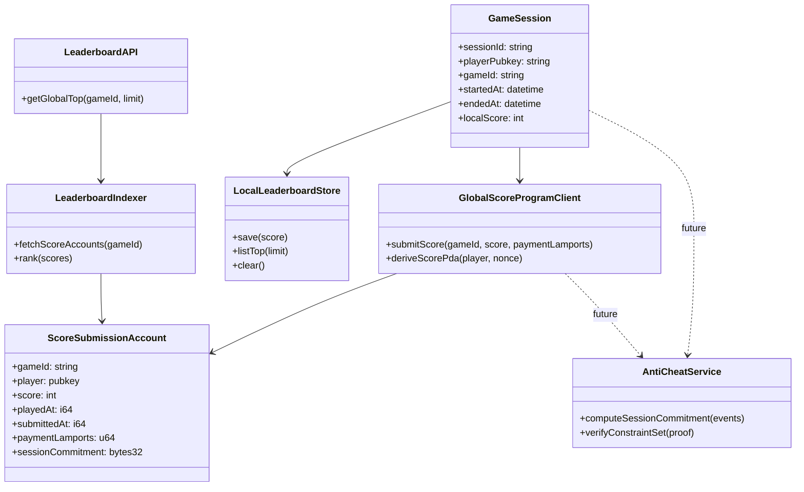

# Initial Class Diagram (Mermaid)

```mermaid
classDiagram
  class GameSession {
    +sessionId: string
    +playerPubkey: string
    +gameId: string
    +startedAt: datetime
    +endedAt: datetime
    +localScore: int
  }

  class LocalLeaderboardStore {
    +save(score)
    +listTop(limit)
    +clear()
  }

  class GlobalScoreProgramClient {
    +submitScore(gameId, score, paymentLamports)
    +deriveScorePda(player, nonce)
  }

  class ScoreSubmissionAccount {
    +gameId: string
    +player: pubkey
    +score: int
    +playedAt: i64
    +submittedAt: i64
    +paymentLamports: u64
    +sessionCommitment: bytes32
  }

  class LeaderboardIndexer {
    +fetchScoreAccounts(gameId)
    +rank(scores)
  }

  class LeaderboardAPI {
    +getGlobalTop(gameId, limit)
  }

  class AntiCheatService {
    +computeSessionCommitment(events)
    +verifyConstraintSet(proof)
  }

  GameSession --> LocalLeaderboardStore
  GameSession --> GlobalScoreProgramClient
  GlobalScoreProgramClient --> ScoreSubmissionAccount
  LeaderboardIndexer --> ScoreSubmissionAccount
  LeaderboardAPI --> LeaderboardIndexer
  GameSession ..> AntiCheatService : future
  GlobalScoreProgramClient ..> AntiCheatService : future
```
