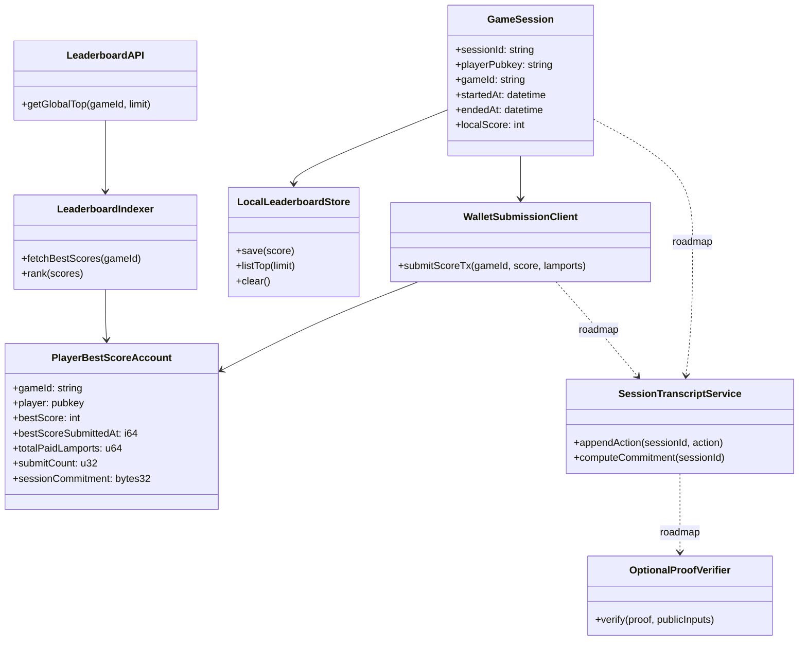

# Initial Class Diagram (Mermaid)

```mermaid
classDiagram
  class GameSession {
    +sessionId: string
    +playerPubkey: string
    +gameId: string
    +startedAt: datetime
    +endedAt: datetime
    +localScore: int
  }

  class LocalLeaderboardStore {
    +save(score)
    +listTop(limit)
    +clear()
  }

  class WalletSubmissionClient {
    +submitScoreTx(gameId, score, lamports)
  }

  class PlayerBestScoreAccount {
    +gameId: string
    +player: pubkey
    +bestScore: int
    +bestScoreSubmittedAt: i64
    +totalPaidLamports: u64
    +submitCount: u32
    +sessionCommitment: bytes32
  }

  class LeaderboardIndexer {
    +fetchBestScores(gameId)
    +rank(scores)
  }

  class LeaderboardAPI {
    +getGlobalTop(gameId, limit)
  }

  class SessionTranscriptService {
    +appendAction(sessionId, action)
    +computeCommitment(sessionId)
  }

  class OptionalProofVerifier {
    +verify(proof, publicInputs)
  }

  GameSession --> LocalLeaderboardStore
  GameSession --> WalletSubmissionClient
  WalletSubmissionClient --> PlayerBestScoreAccount
  LeaderboardIndexer --> PlayerBestScoreAccount
  LeaderboardAPI --> LeaderboardIndexer

  GameSession ..> SessionTranscriptService : roadmap
  WalletSubmissionClient ..> SessionTranscriptService : roadmap
  SessionTranscriptService ..> OptionalProofVerifier : roadmap
```
