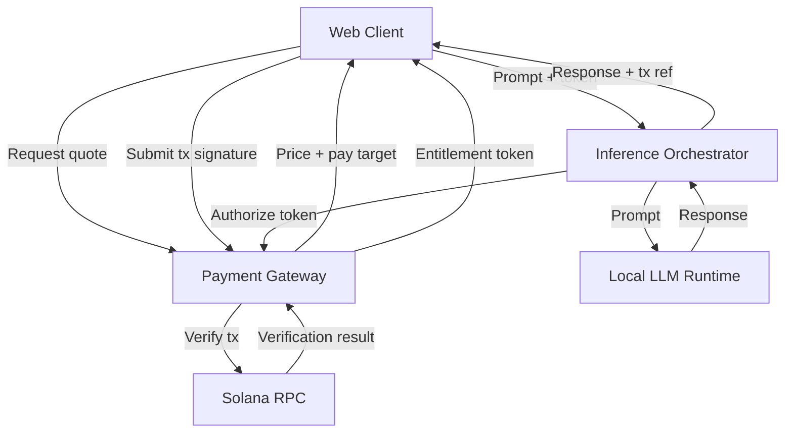

# Dataflow Diagram (Mermaid)

```mermaid
flowchart TD
  A[Web Client] -->|Request quote| B[Payment Gateway]
  B -->|Price + pay target| A
  A -->|Submit tx signature| B
  B -->|Verify tx| C[Solana RPC]
  C -->|Verification result| B
  B -->|Entitlement token| A
  A -->|Prompt + token| D[Inference Orchestrator]
  D -->|Authorize token| B
  D -->|Prompt| E[Local LLM Runtime]
  E -->|Response| D
  D -->|Response + tx ref| A
```
