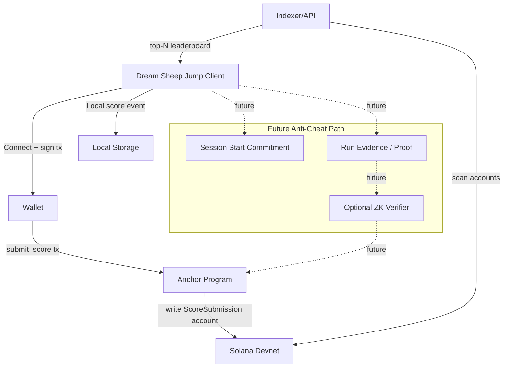

# Dataflow Diagram (Mermaid)

```mermaid
flowchart TD
  A[Dream Sheep Jump Client] -->|Local score event| B[Local Storage]
  A -->|Connect + sign tx| C[Wallet]
  C -->|submit_score tx| D[Anchor Program]
  D -->|write ScoreSubmission account| E[Solana Devnet]

  F[Indexer/API] -->|scan accounts| E
  F -->|top-N leaderboard| A

  subgraph Future Anti-Cheat Path
    G[Session Start Commitment]
    H[Run Evidence / Proof]
    I[Optional ZK Verifier]
  end

  A -.future.-> G
  A -.future.-> H
  H -.future.-> I
  I -.future.-> D
```
