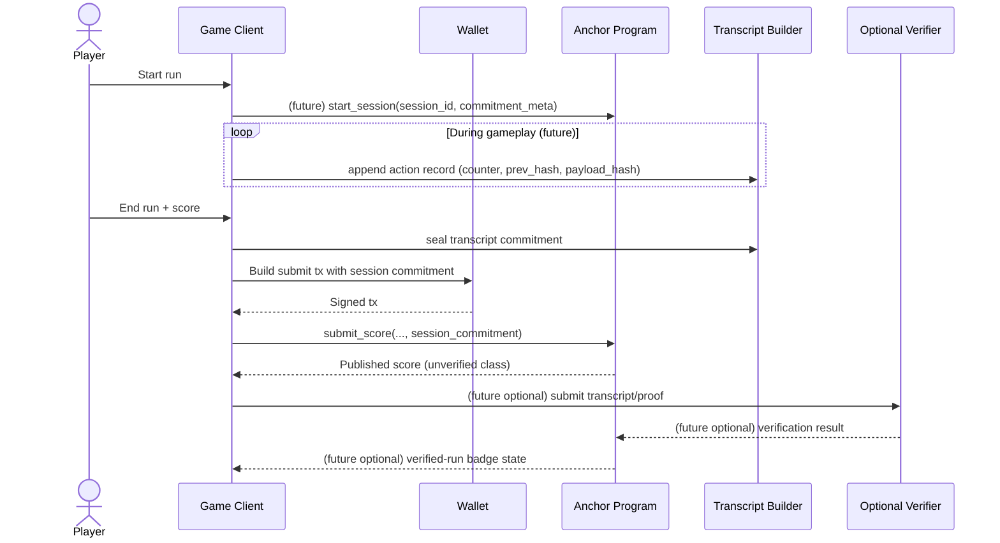

# Sequence Diagram: Future Verified Session Flow (Non-MVP)

```mermaid
sequenceDiagram
  actor P as Player
  participant G as Game Client
  participant W as Wallet
  participant AP as Anchor Program
  participant T as Transcript Builder
  participant V as Optional Verifier

  P->>G: Start run
  G->>AP: (future) start_session(session_id, commitment_meta)
  loop During gameplay (future)
    G->>T: append action record (counter, prev_hash, payload_hash)
  end
  P->>G: End run + score
  G->>T: seal transcript commitment
  G->>W: Build submit tx with session commitment
  W-->>G: Signed tx
  G->>AP: submit_score(..., session_commitment)
  AP-->>G: Published score (unverified class)
  G->>V: (future optional) submit transcript/proof
  V-->>AP: (future optional) verification result
  AP-->>G: (future optional) verified-run badge state
```
