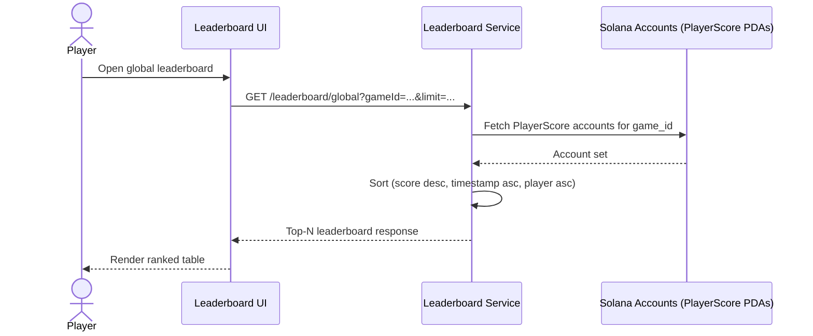

# Sequence Diagram: Current Leaderboard Read Flow (MVP)

```mermaid
sequenceDiagram
  actor P as Player
  participant UI as Leaderboard UI
  participant API as Leaderboard Service
  participant CH as Solana Accounts (PlayerScore PDAs)

  P->>UI: Open global leaderboard
  UI->>API: GET /leaderboard/global?gameId=...&limit=...
  API->>CH: Fetch PlayerScore accounts for game_id
  CH-->>API: Account set
  API->>API: Sort (score desc, timestamp asc, player asc)
  API-->>UI: Top-N leaderboard response
  UI-->>P: Render ranked table
```
