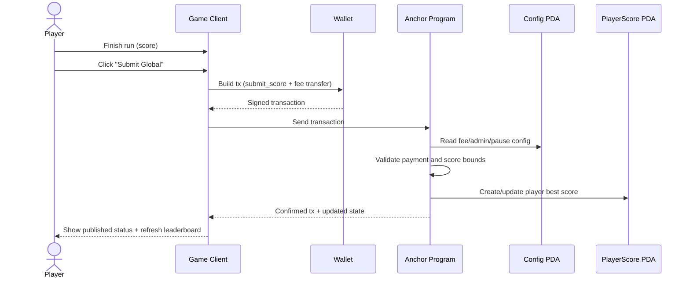

# Sequence Diagram: Current `submit_score` Flow (MVP)

```mermaid
sequenceDiagram
  actor P as Player
  participant G as Game Client
  participant W as Wallet
  participant AP as Anchor Program
  participant C as Config PDA
  participant S as PlayerScore PDA

  P->>G: Finish run (score)
  P->>G: Click "Submit Global"
  G->>W: Build tx (submit_score + fee transfer)
  W-->>G: Signed transaction
  G->>AP: Send transaction
  AP->>C: Read fee/admin/pause config
  AP->>AP: Validate payment and score bounds
  AP->>S: Create/update player best score
  AP-->>G: Confirmed tx + updated state
  G-->>P: Show published status + refresh leaderboard
```
