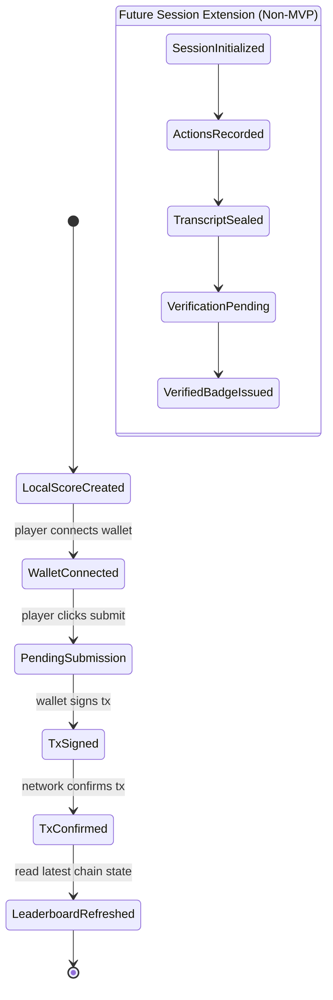

# Submission Lifecycle State Diagram (Mermaid)

```mermaid
stateDiagram-v2
  [*] --> LocalScoreCreated
  LocalScoreCreated --> WalletConnected: player connects wallet
  WalletConnected --> PendingSubmission: player clicks submit
  PendingSubmission --> TxSigned: wallet signs tx
  TxSigned --> TxConfirmed: network confirms tx
  TxConfirmed --> LeaderboardRefreshed: read latest chain state
  LeaderboardRefreshed --> [*]

  %% future extension
  state "Future Session Extension (Non-MVP)" as FUTURE {
    SessionInitialized --> ActionsRecorded
    ActionsRecorded --> TranscriptSealed
    TranscriptSealed --> VerificationPending
    VerificationPending --> VerifiedBadgeIssued
  }
```
