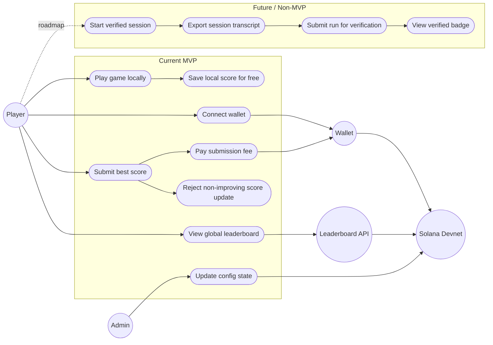

# UML Use Case Diagram (Mermaid)

```mermaid
flowchart LR
  Player((Player))
  Admin((Admin))
  Wallet((Wallet))
  Chain((Solana Devnet))
  API((Leaderboard API))

  subgraph MVP[Current MVP]
    U1([Play game locally])
    U2([Save local score for free])
    U3([Connect wallet])
    U4([Submit best score])
    U5([Pay submission fee])
    U6([Reject non-improving score update])
    U7([View global leaderboard])
    U8([Update config state])
  end

  subgraph FUTURE[Future / Non-MVP]
    F1([Start verified session])
    F2([Export session transcript])
    F3([Submit run for verification])
    F4([View verified badge])
  end

  Player --> U1 --> U2
  Player --> U3 --> Wallet
  Player --> U4 --> U5 --> Wallet --> Chain
  U4 --> U6
  Player --> U7 --> API --> Chain
  Admin --> U8 --> Chain

  Player -. roadmap .-> F1 --> F2 --> F3 --> F4
```
